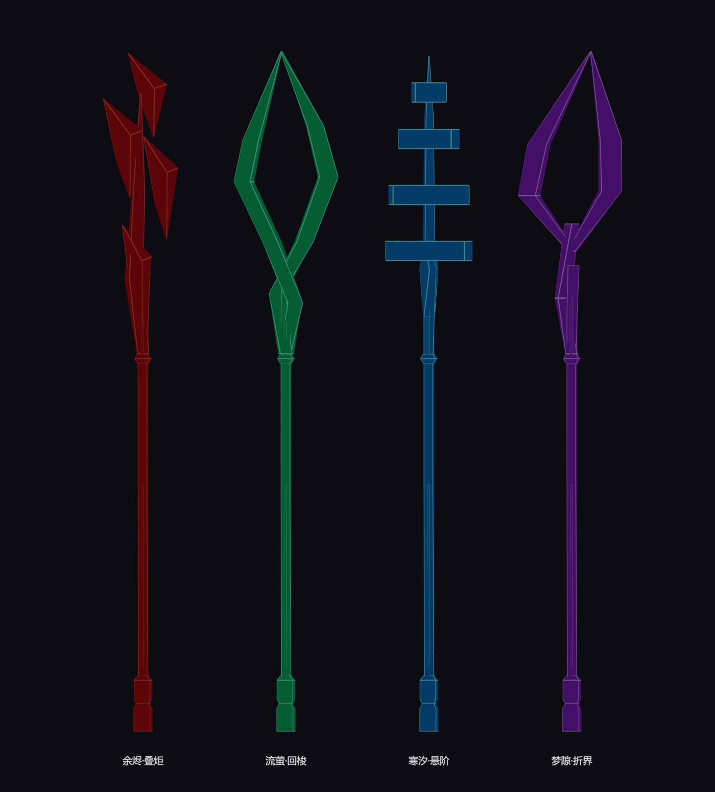

# 四把几何法杖原型

本轮交付四把新外观、第一/第三人称 NIF、装备/锻造/试武箱记录，以及四种专属法术的可编译运行时原型。旧四把外观继续保持删除。



## 获取与操作

使用游戏原有左右手法杖操作，短暂蓄力后释放，不增加快捷键。每把初始容量为 1000；消耗来自法杖充能，额外伤害不消耗玩家魔法值。

控制台输入 `help AAStavesTestChest 4`，然后对显示的 CONT 完整编号执行 `player.placeatme <编号> 1`。也可搜索下表 EditorID 后 `player.additem <WEAP编号> 1`。ESL 完整编号随加载顺序变化，不能直接使用本地编号。

| 法杖 | EditorID / 本地编号 | 原型行为 | 单发消耗 |
| --- | --- | --- | --- |
| 余烬·叠炬 | AAstafftorch / B01 | 30 火伤；同一施法者对同一目标 4 秒内第三次有效命中，追加半径 2 米的 90 火伤爆炸。目标身上的一/两枚小棱片显示层数。 | 20 |
| 流萤·回梭 | AAstaffshuttle / B04 | 直线穿透，去程最远 18 米；碰墙提前折返。折返瞬间记录施法者位置作为固定回程终点，每目标每程最多 45 魔法伤害。每施法者最多一枚在途。 | 30 |
| 寒汐·悬阶 | AAstaffsteps / B07 | 在前方 2/5/8/11 米依次展开四段地面效果，间隔 0.22 秒；每段 15 冰伤与 25% 减速 2 秒；末段对仍有同次前段减速的目标短暂定身 0.7 秒，全局定身免疫 6 秒。 | 30 |
| 梦隙·折界 | AAstafffold / B0A | 直接命中 15 魔法伤害，世界坐标上的固定预警环等待 1.2 秒后造成半径 2.5 米的 105 魔法伤害。最后 0.3 秒预警环收缩。每施法者最多两个在途/待爆实例。 | 40 |

四把法杖可在锻造台以 2 银锭、3 孔雀石锭制作。全部装备试武箱也包含新法杖。SPID 沿用既有 `Item ... |1|0.01` 规则。

## 实现边界

- 需要 **Skyrim SE 1.5.97、对应 SKSE64 和 Address Library**。原生模块针对 1.5.97 安装虚函数钩子，其他运行时拒绝启用；不能把四个空载体当作无需 DLL 的普通原版附魔。
- `ArcaneStaves.dll` 只识别本插件四个专属附魔，其他弹丸/法术沿原调用链执行。载体保留原版充能与释放流程，在首帧转为独立路径模拟。
- 伤害和减速通过独立 SPEL/MGEF 交给游戏引擎，保留实际施法者。没有直接扣血或永久修改移速。红杖由主伤害 ActiveMagicEffect 的 `OnEffectStart` 回报叠层，爆炸不携带此脚本。
- 连续线段检测防止绿杖高速跨帧漏判；使用角色边界近似体积，世界射线阻断墙体。该原型不是逐三角角色碰撞。
- 地面波逐段射线落地，遇墙或过大高度落差停止。爆炸从固定爆点到目标做遮挡检查。视觉是短时实体棱片/线框，没有透明冰墙或导航障碍。
- 玩家及其队友互相保护；敌对 NPC 施法时玩家仍是有效目标。复杂派系、召唤物关系尚需实机回归。
- 菜单暂停计时；切武器不清空已发射实例；施法者死亡/离开原单元会终止实例。临时视觉注册到专属 FLST，读档后清理，不恢复在途法术。
- 法术原型的伤害、距离、特效亮度尚未经过实机平衡。**编译、规则测试、记录及资源验证通过，不等同于已经完成游戏内测试。**

## 0.49.1 崩溃修复

容器菜单的附魔消耗/学派条件计算得到空的主要效果指针，触发 `SkyrimSE.exe+02E2701`。插件现按原版顶层记录顺序写入 MGEF、ENCH、SPEL 等记录，避免先读取引用者再读取新效果；四个载体指定毁灭学派。验证器检查本插件 EFID/EITM 的前置定义，DLL 在 DataLoaded 检查全部十二个魔法记录的实际效果数组和主要效果，并将结果写入 ArcaneStaves.log。旧版本在新增顺序检查上失败，修复版通过。

保留原有编号，无需重新生成法杖。单发消耗表为基础消耗；毁灭学派技能、装备与相关 perk 可通过原版规则调整实际消耗。修复仍需实机确认：重新启动游戏、打开试武箱，依次选中四把法杖，再检查背包、装备和施法。

## 必做实机验收

1. 四把依次测试第一/第三人称、左右手、收拔、丢弃碰撞；确认握柄没有穿掌、杖头不遮挡瞄准。
2. 每把蓄力取消不扣充能，释放只扣一次；绿杖在途/紫杖满额时第二只手也不能绕过上限。
3. 红杖对普通敌人连射三次、间隔超过 4 秒、换目标、火免目标和吸收/结界目标；第三次直接击杀仍应爆炸。确认脚本回调延迟不影响手感。
4. 绿杖对前后两名敌人穿透再回程；射出后移动，确认回程终点只在折返瞬间取样；去程和回程墙体均应阻挡；每程不重复伤害。
5. 蓝杖测试平地、斜坡、台阶、墙角与悬崖；目标需移动到最后一段且仍携带前段减速才定身；龙/巨人/麻痹免疫目标不定身。
6. 紫杖射地面、敌人、墙面；目标离开爆点可躲开，目标死亡不取消爆点，隔墙目标不受伤。
7. 保存/读档、切单元、暂停、死亡及 NPC 使用：没有遗留棱片、永久减速或充能锁死。日志为 `Documents/My Games/Skyrim Special Edition/SKSE/ArcaneStaves.log`。

## 构建与验证

从仓库根目录运行：

```powershell
python mods/arcane-arsenal/source/prepare_staff_reference.py
& reference/bow-tools/blender-4.5.13-windows-x64/blender.exe -b --python-exit-code 1 --python mods/arcane-arsenal/source/build_arcane_staves.py
& reference/bow-tools/blender-4.5.13-windows-x64/blender.exe -b --python-exit-code 1 --python mods/arcane-arsenal/source/build_staff_fx.py
python mods/arcane-arsenal/source/compile_staff_runtime.py
python mods/arcane-arsenal/source/build_plugin.py
python mods/arcane-arsenal/source/verify_staff_plugin.py
& reference/bow-tools/blender-4.5.13-windows-x64/blender.exe -b --python-exit-code 1 --python mods/arcane-arsenal/source/verify_arcane_staves.py
python mods/arcane-arsenal/source/package_mod.py
```

法杖专属记录段 B00–B7F；`staff_plugin.py` 按 TES4 主文件数确定自身索引，保留现有武器、弩及其本地 FormID。它只为全部试武箱追加物品，不重建已有武器模型。
